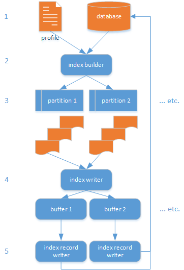

# Embix

This solution is work in progress. It provides a set of components you can use to build a very simple words index embedded in a relational database, ready for your searches.

This project is part of the [Cadmus system](https://github.com/vedph/cadmus_doc), but it stands out as an independent tool. In the context of the Cadmus system, it has been designed to integrate in a wider environment with a number of different usages. The most relevant one at this time is providing text indexes for RDBMS systems which should feed standalone API wrappers around third party resources. In turn, these API services would then be consumed (among others) by Cadmus editors.

For instance, say you want to add data about a place in your Cadmus database; you might want to have a geographic data part which allows you to lookup some gazetteers and find the desired location, with all its metadata and identifiers. To this end, if the gazetteer does not provide its own public web API, I'd like to create one wrapping its data, with the search functions I want to include. As a part of this, I'd need to build an index of place names and of all the relevant words connected to them, directly inside my geographic database. Of course, this implies a number of preprocessing steps to get a more efficient search, capable of finding variants, stripping out noise features from names, dropping stopwords, transliterating non-romanized names, etc.

The geographic database is used here as a sample, but of course any other database may require the same indexing capabilities. For instance, you might have a database of manuscripts like that of [Pinakes](https://pinakes.irht.cnrs.fr/), and want to provide a search tool for all its text-related fields. Any other database would do, as far as some of its fields include some text-based information.

So, whatever your database and its data, this is where Embix comes into play, as a quick and customizable solution for a typically repeated process. Its first purpose is making me spare time and avoid implementing the same solution again and again. Anyway, given that it's a reusable tool which could be of some use for others, and that it's part of Cadmus, which is totally open-source, I've made this repository public.

## Introduction

Typically, you may often find yourself having to search for text in a number of fields from one or more tables.

For instance, say you have a geographic gazetteer: you might want to search for text inside some of the fields like place names, descriptions, etc., further combining this search with other metadata (location area, date range, etc.). In this context, you might even end up with just a `LIKE`-search, where all what you do is searching for all the fields matching a substring.

In fact, in most cases a full-blown text search engine would be an overkill here; and often it would provide a less than optimal integration with the rest of your data.

Yet, the minimalist `LIKE` approach would not be the best option, too. Even though we're just looking for some portions of a short text field, we should be able to filter some noise out of our text, to ensure things can match at best.

For instance, apart from case differences, which usually are ignored in the most popular RDBMS collation schemes, a place name might include diacritics, or be written in a non-romanized alphabet. So, if you are looking for a place like `Ardigò` you might not find it when searching `ardigo` or `Ardigó`.

Often, names might even be more complex, like `Coucy-lès-Eppes`, where not only diacritics, but also some characters like dashes should be ignored for the purposes of the search.

Further, if you are looking for a Greek name like `Ἀθῆναι`, you might want to search it both in its original alphabet (still ignoring diacritics, so that just looking for `αθηναι` would match it), and in its conventional transliteration(s), e.g. `Athênai`, or simply `athenai`.

Additionally, it often happens that your database does not include only single names, but also longer texts. For instance, for a place name `Noviomagus Treverorum` you might have a description like this: "This settlement of the Treveri (modern Neumagen in Germany) served for a time as market and road station and was later the site of a late Roman fortification. Extensive funerary remains also survive". So, in this case you would probably want to extend your search also to such descriptions; this way, one would find the place even by searching for `Neumagen` or `Treveri`. Yet, when looking for places we would probably not be interested in indexing words like `this`, `of`, `the`, `for`, and other similar words found in the above sample description. In fact, most search engines addressed to find some core data beyond its surface form make use of "stopwords" lists for such cases, i.e. a list of words you want to exclude from the index.

Finally, there are cases when your data have been ingested into a database with different levels of normalization, especially when they come from a lot of sources. For instance, a list of place names might occasionally record several names under the single field reserved for one name only, like in `Noviomagus/Nemetae`, where the `/` character effectively separates two forms of the name. Or, some of your descriptions might include HTML or XML fragments, with tags embedded in them, and of course you want to strip out the tags.

So, even though we're not interested in a complete full-text search engine, we still require a certain level of preprocessing for the text fields we want to index in our database. In a smaller scale, what we essentially need here are two types of processing typical in text search engines:

- **tokenization**: split a text into "words". For instance, typically we split English texts at spaces and apostrophes, so that a form like `place's` can be handled as two words (`place` and `s`). Yet, other languages might have different requirements. Maybe in a multi-language geographical database you might often have transliterations involving apostrophes, which must be included in the name. In this case, you would not want to apply the same treatment you use for English text in terms of word splitting.
- **filtering**: filter out noise features from our words. For instance, removing diacritics, normalizing whitespaces, flattening case, etc., so that a word like `Ἀθῆναι` becomes `αθηναι`. More radical transformations would also be possible, so that `Ἀθῆναι` can be automatically transliterated into `Athênai`. This way, even if your data only include the form `Ἀθῆναι`, your users will be able to find it even searching for `athenai`.

We can thus imagine as a typical scenario that a software tool would collect all the data to be indexed in this way, preprocess them as required, and store the result in a couple of index tables: one with the list of all the words, and another with the list of all the occurrences for each word.

Given the above requirements, this is a fairly typical scenario. So, rather than re-implementing it each time, I chose to provide a simple, yet effective tool which can be tailored to the requirements of any RDBMS database. That's where Embix comes into play.

In its essential form, Embix provides a multi-platform (Windows, MacOS, or Linux) command line tool fed by a JSON configuration file. You just have to prepare the configuration file, which tells the tool which fields from which tables are to be indexed, and how they must be preprocessed. Once you have this file, just launch the tool to create a couple of tables in your database, and have them filled with words and occurrences. Once they are in place, you can easily query this text index in the context of the database itself, thus providing you with a more robust and effortless text-based search.

## Features

Currently, Embix provides these features:

- pick _all the text fields we want_ to index, from whatever table we want, using any SQL query.
- target _multiple languages_, so that each word can be indexed with its language if required.
- eventually _process each text field differently_, when filtering and tokenizing it.
- optionally record additional, _custom metadata_ about the occurrence of each word in your database. For instance, this might be the case of date ranges for a place name, or a rank about its certainty level.
- preserve the information about the _source of each text_, so that we can later limit the search in a subset of the available sources. For instance, in a list of places we might index both the place's name and its description field; later, a user might decide whether to look only among titles, or extend the search to descriptions. Of course, this requires that we save the source of each occurrence of any indexed word.
- be able to _parallelize the indexing process_ to increase performance. This is an essential requirement to minimize the time cost of indexing, which might be very high.
- use _any RDBMS system_ among the most popular ones, like MySql/MariaDB, MS SqlServer, or PostgreSql.
- provide plugins for automatic transliteration of Greek text, with a highly customizable behavior.

Embix provides an infrastructure to automate this process, starting from a simple JSON-encoded indexing profile.

To this end, this solution has a generic approach, based on the concept of "documents".

## Document

A _document_ in Embix is defined as the set of fields returned by an SQL query, whatever its complexity.

Each field to be processed for indexing in this query is _aliased_, so that its name can be used as a _unique_ identifier for that specific combination of table name and field name.

For instance, say a table in our database lists some places, and among other fields it has a primary key field named `id`, and some text fields named `title`, `description`, and `details`.

In this sample, we could define our "document" with a `SELECT` query template like this, where placeholders `{0}` and `{1}` represent values to be replaced at runtime:

```sql
SELECT title AS plttl,
      description AS pldsc,
      details AS pldtl,
      id AS m_targetid
      FROM place
      ORDER BY place.id
      LIMIT {1} OFFSET {0};
```

This query defines a "document", i.e. a source of text to be indexed, here with 3 fields to be indexed (`title`, `description`, `details`), and a fourth one (`id`) to be used as metadata during indexing (the convention is to prefix each alias of a metadatum field with `m_`).

In this case, the metadatum is just the ID of the record being indexed, which is always required, and must be aliased as `m_targetid`; but also other metadata might be used, like e.g. `m_language`.

Whatever the fields we select, the target index has a very simple schema, consisting of 2 tables:

- `token` table: all the tokens from 1 or more languages. Each combination of token and language is unique in the table.

  - `id` (int PK AI): a numeric identifier assigned by the system to the token. This is usually an autonumber field in a RDBMS, even though Embix does explicitly assign numbers on behalf of the database. This is essentially done for performance reasons, as generating an ID on the client side allows Embix to spare a travel back to the database for each newly added record just to get its assigned ID.
  - `value` (string): the token's text value.
  - `language`: an optional (nullable) language code (usually [ISO-639](https://en.wikipedia.org/wiki/ISO_639)).

- `occurrence`: all the occurrences for any given token. Occurrence tables may have a number of metadata, which vary according to the database being processed.

  - `id` (int PK AI): an numeric identifier assigned by the system to the occurrence. This is handled by the RDBMS system.
  - `tokenId` (int FK): the ID of the token this occurrence refers to.
  - `field` (string): the field name as derived from the document's query, identifying the original table's name and field name.
  - `targetId` (string): this is a string with the ID of the record from the corresponding source query. This ID is not necessarily a string; but using a string ensures that we can store in the same table any type of ID (numeric, GUID, etc.).
  - any other field from metadata. These are all optional fields, defined by users, so that they are always nullable.

In the case of the sample query above, a record from the `place` table would provide texts from 3 fields (coded as `plttl`, `pldsc`, `pldtl`). Each of these texts will be processed according to the document's configuration, which specifies:

- which filters must be applied to the text as a whole, before tokenization.
- which filters must be applied to each token from the filtered text.

The configuration for each document is stored in an Embix profile.

## Text Pipeline

Each text indexed by Embix goes through a set of components chained in a pipeline. Each document (in the sense defined above) can have its own pipeline of components, configured as required. Embix automatically selects the pipeline according to the document being handled.

The components in a pipeline are:

1. zero or more global _text filters_, which filter the text as a whole.
2. one _tokenizer_, which chunks the text into tokens ("words").
3. zero or more token _text filters_, which filters each single token.
4. zero or one _token multiplier_, which emits the token with any additional token derived from it. This may happen e.g. when adding synonyms, stemming or inflecting forms, transliterating, etc. For instance, in a project we need to transliterate all the Greek words found in a text, so that the final index contains not only the (filtered) Greek word, but also its conventional transliteration in Roman characters. The configuration fragment below shows a Greek transliterator being used as a token multiplier, with its full set of options. When this is applied, every token generated by the pipeline is multiplied into itself plus eventually its transliterated form.

```json
"TokenMultipliers": [
  {
    "Id": "rom",
    "TypeId": "string-token-multiplier.grc-romanizer",
    "Options": {
      "TargetTable": "$GtrTarget7",
      "KsiAsX": true,
      "KhiAsCh": true,
      "IncludeIpogegrammeni": false,
      "GammaPlusVelarAsN": false,
      "HAfterRR": true,
      "ConvertPunctuation": true
    }
  }
]
```

## Profile

A _profile_ is a JSON document which specifies:

- a set of **chains** of text filters, each with its own, arbitrary chain ID. This chain ID is then recalled in other sections of the same profile. Each filter is an object having an `Id` (referred to the filter's unique tag) and a `Filters` property. The `Filters` property is an array with any number of objects, each representing a filter in the chain. Every filter has an `Id` and eventually an `Options` custom object, with options specific to that filter. Inside each chain, filters are applied in the order they are defined here.
- a set of **tokenizers** definitions, each with its own, arbitrary ID. This ID is recalled in other sections of the same profile. Each tokenizer is an object which besides this ID has a `TypeId` (referred to the tokenizer's unique tag) and the ID of a filters chain, when requiring filters.
- a set of **token multipliers** definitions, each with its own, arbitrary ID. This ID is recalled in other sections of the same profile. Each multiplier is an object which besides this ID has a `TypeId` (referred to the multiplier's unique tag) and eventually some `Options`.
- a set of **token's fields lengths**, defining the maximum allowed length for the string fields of a token: `value`, and `language`. The indexer ensures that these length limits are respected, by truncating any longer text (while adding an error entry in the log about this).
- a set of **occurrence's fields lengths**, as for tokens but for occurrence's fields. Usually this is an empty object, but it can have properties when occurrences have further fields from metadata.
- a set of **metadata fields**, added to the occurrences basic fields.
- a set of **document** definitions, each with its own, arbitrary ID. A document definition has the SQL code for selecting the total count of records and the data to be indexed. It also has the ID of the filters chain to be applied to the text as a whole, and the ID of the filters chain to be applied to every token from the text.

For example, consider this profile having 2 chains, 2 tokenizers, and 1 document definitions:

```json
{
  "FilterChains": [
    {
      "Id": "tag-wsp-std",
      "Filters": [
        {
          "Id": "text-filter.tag"
        },
        {
          "Id": "text-filter.whitespace"
        },
        {
          "Id": "text-filter.standard"
        }
      ]
    },
    {
      "Id": "stp",
      "Filters": [
        {
          "Id": "text-filter.stopword"
        }
      ]
    }
  ],
  "Tokenizers": [
    {
      "Id": "std",
      "TypeId": "string-tokenizer.standard",
      "FilterChain": "stp"
    },
    {
      "Id": "nul",
      "TypeId": "string-tokenizer.null"
    }
  ],
  "TokenFieldLengths": {
    "value": 100,
    "language": 5
  },
  "OccurrenceFieldLengths": {},
  "MetadataFields": ["rank", "yearMin", "yearMax"],
  "Documents": [
    {
      "Id": "place",
      "CountSql": "SELECT COUNT(*) FROM place;",
      "DataSql": "SELECT title AS plttl, description AS pldsc, details AS pldtl, id AS m_targetid FROM place ORDER BY place.id LIMIT {1} OFFSET {0};",
      "TextFilterChains": {
        "*": "tag-wsp-std",
        "nmlng": "lng"
      },
      "Tokenizers": {
        "*": "std",
        "nmlng": "nul"
      }
    }
  ]
}
```

Here, the first filters chain, with ID `tag-wsp-std`, includes an HTML/XML tags stripping filter, a whitespace filter and a standard filter. The second filters chain, with ID `stp`, includes just a stopwords filter.

The only document has ID `place`, has a couple of SQL commands defined to retrieve the records count and data, and refers to the chains defined above: the text filters used for all the fields (`*`) except those explicitly listed (like here `nmlng`) are from chain `tag-wsp-std`; the tokenizer filters for all the fields (`*`) except those explicitly listed are from chain `stp`.

This means that for each (non-metadata) selected field in each record from the place table, its value (when not null) will be first filtered for tags, whitespace and other standard features; then tokenized; and finally each token will be further filtered for stopwords. Any token surviving these filters will then be stored in the index.

All the metadata fields which should be stored in the `occurrence` table are listed in the `MetadataFields` array. It is up to the user add the required fields to the basic occurrence table so that metadata can be stored with each occurrence. Note that all these additional fields must be nullable, as they are all optional.

To process each document, you must use a corresponding `IndexBuilder` object. This reads the profile, partitions the records to be indexed in subsets, and spawns one thread for each. Every thread opens its connection to the database, and reads records from it. For each record, it collects metada fields and processes data fields, generating a number of tokens. Each token gets passed to an index writer (implementing `IIndexWriter`), in charge of storing tokens and their occurrences in the database.

## Index Writer

In most cases, the `SqlIndexWriter` can be used as a writer. It uses [SqlKata](https://sqlkata.com/) to implement a DB-engine agnostic approach, while still adopting a bulk write strategy. This way, the same writer can be used for the most popular RDBMS systems, like MySql (or MariaDB), Microsoft SQL Server, and PostgreSQL.

In its target database Embix uses just two simple tables for storing index data:

- `token`: a fixed-schema table, including all the unique tokens extracted from documents. Tokens are treated as unique when their value and language are equal. A token includes a numeric ID, a target ID in the form of a string, a value, and an optional language.
- `occurrence`: a variable-schema table, including at a minimum a numeric ID, a token ID (FK), a field code (representing the source of the occurrence, and directly derived from the field's alias in the select query), and as many other fields for metadata as you want.

## Flow

The essential index flow is represented by this picture.



1. From top to bottom, we start with the database to be indexed and a profile JSON document.
2. Then, for each source document (in the sense explained above) the index builder decides the number of partitions to split the total rows into. It then spawns as many parallel threads as partitions, each processing one of them.
3. Every partition thread reads data row by row, analyzing the text fields from each; the result is a list of filtered tokens. Tokens are then wrapped into index records. An index record is an abstraction composed by a token and its occurrence, where the token can be missing if it has already been found. In this case, the occurrence is enough, as it carries the ID of the token it refers to. The token ID is generated by the index builder, which ensures that each parallel process gets a unique, automatically incremented numeric identifier.
4. each index record gets passed to an index writer. In our case, this is a buffered writer, which reduces the number of roundtrips to the database. The buffered writer has a buffer for each partition. It fills each buffer accordingly, up to its maximum capacity; when this is reached, the buffer is emptied and its contents are passed to an index record writer.
5. the index record writer (there is one for each buffer) receives the records and writes them into the database. The writer ensures that no occurrence is written before the token it refers to (or a FK constraint error would occur).

## Embix CLI

Command-line interface tool to access Embix functions.

### Init Index Command

Initialize (create or eventually clear) the index tables in the target database.

Syntax:

```bash
./embix init-index <DatabaseName> [-t <DatabaseType>] [-c]
```

- `DatabaseName` is the target database name.
- `-t` specifies the database type: `pgsql` or `mysql`. Other types will follow as they are needed. Adding a new type is as simple as creating a new project and implementing a couple of classes.
- `-c` tells the initializer to truncate the tables if they are found. Otherwise, the command will create them.

### Build Index Command

Builds an index inside the specified database. If not present, `token` and `occurrence` tables are created with their default schema. When using metadata, you should ensure that you add the required fields to the `occurrence` table. To this end, you can use the `init-index` command to create the base tables, and then extend the `occurrence` table at will.

Syntax:

```bash
./embix build-index <JsonFilePath> <DatabaseName> [-t <DatabaseType>] [-c] [-p <PartitionCount>] [-s <MinPartitionSize>] [-b <BufferSize>] [-l <RecordLimit>]
```

- `JsonFilePath` is the path of the JSON profile file for Embix.
- `DatabaseName` is the target database name.
- `-t` specifies the database type: `pgsql` or `mysql`.
- `-c` tells the initializer to truncate the tables if they are found. Otherwise, the command will create them.
- `-p` specifies the number of partitions in which input records are distributed during indexing, thus parallelizing the process. The default value is 2. Use 1 to avoid multiple threads, or higher values for better performance (according to the available hardware).
- `-s` specifies the minimum partition size when using parallelized indexing (default=100). When the total number of records to be indexed for each document is less than this size, no parallelization will occur.
- `-b` specifies the tokens buffer size. Default value is 100. This is the number of tokens which get buffered in memory before flushing them to the target database. Buffering avoids too many roundtrips to the server, with relevant performance gains.
- `-l` specifies an artificial limit for the records to be imported. This can be used for test purposes.

### Inspect Characters Command

Inspect the characters from selected documents (in the sense specified above). The documents define all the text fields from all the tables you want to inspect. They are defined in a JSON profile file similar to the one illustrated above, where the root element is an array of document definitions. Each definition has a count query and a data query (no paging here), e.g.:

```json
[
  {
    "CountSql": "SELECT COUNT(*) FROM textnodeproperty p INNER JOIN textnode n ON p.nodeid=n.id WHERE n.corpus='packhum' AND p.name='text';",
    "DataSql": "SELECT value FROM textnodeproperty p INNER JOIN textnode n ON p.nodeid=n.id WHERE n.corpus='packhum' AND p.name='text';"
  }
]
```

The fields name is not relevant; you should just ensure that any field selected here is a text field, either nullable or not.

Syntax:

```bash
./embix inspect-chars <JsonFilePath> <DatabaseName> <OutputPath> [-t <DatabaseType>]
```

- `JsonFilePath` is the path of the JSON profile file for Embix.
- `DatabaseName` is the target database name.
- `OutputPath` is the CSV output file path.
- `-t` specifies the database type: `pgsql` or `mysql`.

Sample output: a CSV file with columns for hexadecimal code, decimal code, Unicode category, glyph, and frequency.

```csv
hex,dec,cat,glyph,freq
"0009",9,Sm,.,88
"000A",10,Sm,.,88
"000D",13,Sm,.,88
"0020",32,Zs, ,224
"0061",97,Ll,a,3
"0063",99,Ll,c,1
"0067",103,Ll,g,3
"03B1",945,Ll,α,59
"03B2",946,Ll,β,4
"03B3",947,Ll,γ,10
"1F00",7936,Ll,ἀ,13
"2014",8212,Pd,—,134
```
